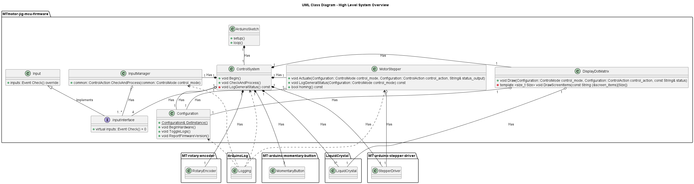

# MTmotor-jig-mcu-firmware

[](https://github.com/Morgritech/MTmotor-jig-mcu-firmware/actions/workflows/static-check.yaml) [](https://github.com/Morgritech/MTmotor-jig-mcu-firmware/actions/workflows/build-project.yaml)

Microcontroller firmware for MTmotor-jig; a test jig for testing motors and motor control devices.


## Introduction

### Microcontroller

Arduino MEGA 2560 is the primary target for this project.

### Programming languages and frameworks

The primary language for this project is the [Arduino programming language](https://www.arduino.cc/reference) (a subset of C/C++).

### Coding standard

This project follows the [Google C++ Style Guide](https://google.github.io/styleguide/cppguide.html).

### Build system and programming environment/toolchain

This project doesn't impose any specific build system, however the preferred method is to make use of the tools provided by the Arduino eco-system such as [Arduino CLI](https://arduino.github.io/arduino-cli) and/or the [Arduino IDE](https://www.arduino.cc/en/software). See the "Setup and build" section for more details.

### Continuous integration/delivery (CI/CD)

[GitHub Actions](https://docs.github.com/en/actions) is used as the CI/CD platform, and the workflow also makes use of the [Linux setup script](external/mt-arduino-cli-scripts/setup-build-linux.sh).

### External libraries

The following libraries (available via the [Arduino library manager](https://www.arduino.cc/reference/en/libraries)) are used within the project:

- [MT-arduino-rotary-encoder](https://github.com/Morgritech/MT-arduino-rotary-encoder)
- [MT-arduino-momentary-button](https://github.com/Morgritech/MT-arduino-momentary-button)
- [MT-arduino-stepper-driver](https://github.com/Morgritech/MT-arduino-stepper-driver)
- [Arduino-Log](https://github.com/thijse/Arduino-Log)
- [LiquidCrystal](https://github.com/arduino-libraries/LiquidCrystal)
- [SD](https://github.com/arduino-libraries/SD)
- [ArduinoJson](https://github.com/bblanchon/ArduinoJson)

### UML class diagram

The image below shows a high level overview of the system:



## Setup and build

As with any other Arduino project, you can simply download the project and open the sketch folder ([src](src)) in the Arduino IDE. You can manually install the required libraries via the built-in library manager in the IDE, and build/compile/upload the project via the relevant options in the IDE.

OR

You can work without an IDE by making use of the provided [setup/build scripts](external/mt-arduino-cli-scripts) and/or Arduino CLI. See the [README](external\mt-arduino-cli-scripts\README.md) for full details.

> [!NOTE]
> The scripts are included as a Git submodule. In order to bring them into the project after cloning, run the following command:

``` shell
git submodule update --init --recursive
```

> [!NOTE]
> Running the setup/build scripts will install arduino-cli and other dependencies (Arduino cores and libraries) on your device.

## System setup

The project provides a means to initialise various configuration settings via a file (JSON format) on the SD card (must be FAT16 or FAT32 formatted). The program will first attempt to read a file called "default.txt", and if not found, will attempt to read the first available file (name must be 8.3 format) on the SD card.

An example configuration file is provided (see [configs/default.txt](configs/default.txt)). All nodes and key-value pairs shown in this file must be present in any custom configuration file. Comments are disabled.

The following keys must be provided with valid values from the options shown below:

|Node|Key|Valid Values|
|----|----|----|
|inputs|longPressOption|"detect while holding" , "detect after release"|
|stepper|accelerationAlgorithm|"morgridge24" , "austin05" , "eiderman04"|
|buzzer|enabled|true , false|

## System control and logging/status reporting

The project provides a means of controlling the system and interrogating the status of the system via serial messages, once the programme is uploaded to the Arduino board. The following messages are implemented:

|Message|Action|
|:----:|----|
|n|Select **next** mode.|
|p|Select **previous** mode.|
|d|Toggle motion **direction** clockwise (CW)/Counter-clockwise (CCW).|
|a|Cycle through motion **angles**.|
|s|Cycle through motion **speeds**.|
|m|Toggle **motion** ON/OFF.|
|x|Reset the home position to the current position.|
|h|Move to the **home** position.|
|r|Toggle log **reporting** ON/OFF.|
|l|**Log**/report the general system status.|
|v|Report firmware **version**.|
